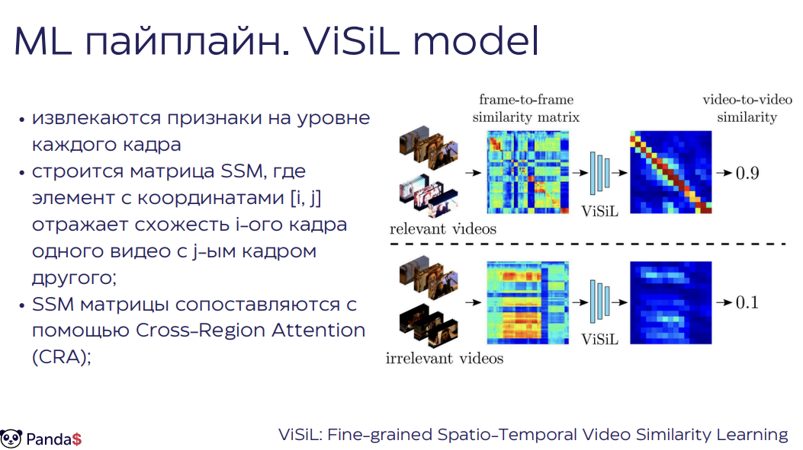
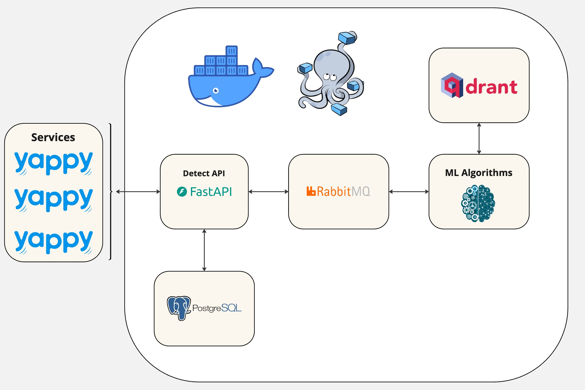

<p align="center"></p>
<h1 align="center">Сервис по определению дубликатов видео</h1>

### API расположено по  [ссылке](http://188.124.36.137:8000/docs) 
### Документация расположена по [ссылке](https://docs.google.com/document/d/13BHxBUGgbUq1RGEGvkENxdHe2Dis3eCGdT8JQeym-6s/edit?usp=sharing)

## Основная структура
Сервис "Дубль" предназначен для обнаружения дубликатов видео с целью соблюдения авторских прав. Основной подход решения включает использование передовых методов машинного обучения, таких как модели ViSiL (Video Similarity Learning) и S2VS (Self Supervised Video Similarity), что позволяет эффективно определять схожесть видеоконтента. 

В исходной архитектуре в процессе обработки строится матрица сходства (SSM) на основе признаков каждого кадра, а для анализа применяется метод Cross-Region Attention. Для повышения скорости работы архитектура модели была изменена: Cross-Attention был убран, а модель дообучена с использованием contrastive loss-а для сближения признаковых представлений. Такая модель позволила не только избавиться от линейной зависимости от размера векторной БД, но и повысить качество до f1=0.98. Оптимизация архитектуры позволяет достичь высокой скорости обработки (3 секунды на видео без использования GPU, 2 секунды с использованием графического ускорителя) и гибкости в масштабировании благодаря предварительному индексированию и разделению логики ML и API.




## Пайплайн API
Архитектура сервиса "Дубль" разделена на две основные части: ML-обработку и API-логику, что обеспечивает гибкость и высокую отказоустойчивость. Основное преимущество заключается в возможности предварительного индексирования данных, что позволяет существенно сократить время обработки и повысить скорость работы сервиса, не увеличивая время отклика при росте объема базы.



***Проект построен на принципах микросервисной архитектуры с целью обеспечить надежность и дальнейшую масштабируемость.***

## Используемые технологии

### RabbitMQ

- RabbitMQ является мощной и надежной системой обмена сообщениями. Она обеспечивает асинхронную коммуникацию между
  сервисами, что важно для построения отказоустойчивых и масштабируемых микросервисных архитектур.

### Qrand

- Qrand современная векторная база данных, помогающая хранить и поддерживать огромное количество размеченных видео

### REST API

- REST API обеспечивает стандартизированный подход к построению веб-сервисов, что делает их легко доступными и
  интегрируемыми с различными клиентами и сервисами.

### Docker-compose

- Docker-compose помогает инкапсулированно развертывать приложения на сервере при деплое. Так же дает огромные
  возможности в рамках добавления сложных CI/CD инструментов

## Документация
Документация и описание исследовательской части работы  [ссылке](https://docs.google.com/document/d/13BHxBUGgbUq1RGEGvkENxdHe2Dis3eCGdT8JQeym-6s/edit?usp=sharing)
Алгоритмы ML расположены в [ml_algo](ml_algo)

Функционал и пайплайны разделены по различным модулям:
Все модули и функции документированы 
1. Локальная валидации (сбалансирована относительно генеральной совокупности и не пересекается с ней) [.csv](ml_train/cp_vseros_train_1000.csv) 
2. Функция инференса модели для получения индекса и ближайших видео [module](ml_algo/ml_algo.py) 
3. Функция, реализующая конечный функционал ручки api - скачивание видео, проверку и формирование результата [module](ml_algo/check_duplicate.py) 
4. Функция скачивания виде в отдельном модуле [module](ml_algo/utils.py) 
5. Использование SSL модели [notebook](ml_train/s2vs_model_using.ipynb)
6. Использование ViSiL модели [notebook](ml_train/ViSiL_finetuning.ipynb)
 
## Быстрый старт

1. Клонируйте репозиторий:

```shell
git clone https://github.com/Lareton/digital_hack_yappy.git
```

2. Склонировать подмодуль

```shell
git clone -b pytorch https://github.com/MKLab-ITI/visil ml_algo/visil_pytorch
```

4. Запустите сервисы:

```shell
docker compose up --build -d
```

## Swagger

#### Swagger API лежит по [этой](http://188.124.36.137:8000/docs) ссылке после развертывания приложения 

## Команда

Проект разработан командой Selling Pandas в рамках хакатона Цифровой прорыв, кейс Yappy.
